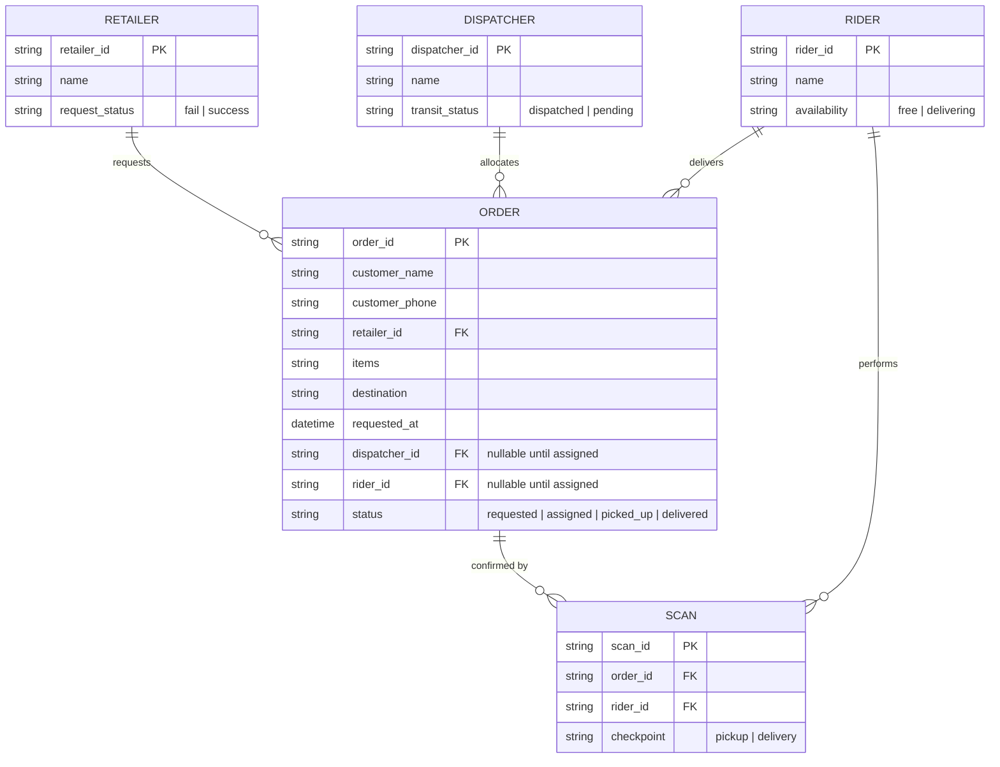
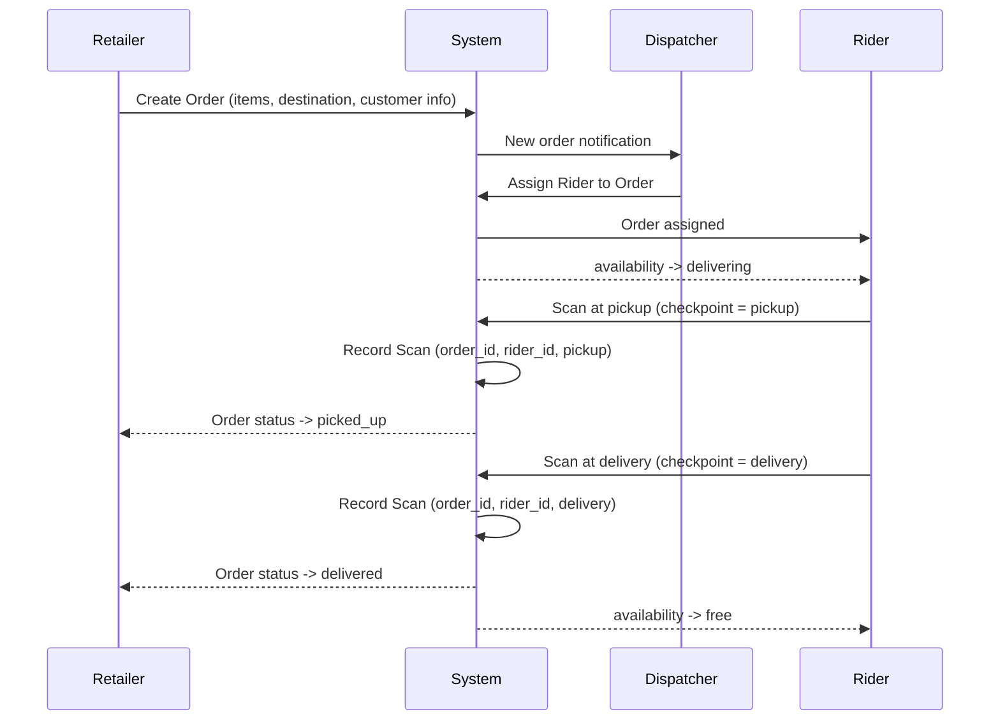

# Reflex System Design

Group 67 · Week 3 (Reflex, The Readiness Sprint)

The differentiator is doubled scan confirmation. The rider scans at both pickup and delivery,
and each scan traces back to the exact order and rider who made it.

## Entity Relationship Diagram

## System Design Workflow

The doubled confirmation shows up as two `Scan` rows per order, each one tied to the order and
the rider who performed it. Not a claim in the pitch deck. Something you can actually query.

## Known Deviations From This Design

- **Scan.scanned_at** — the AI Studio build adds a timestamp per scan, not
  specified above. Kept deliberately: it lets delivery duration be computed
  (delivery scan time minus pickup scan time) and removes any ambiguity about
  which of the two Scan rows happened first. Confirmed acceptable 2026-08-31.
